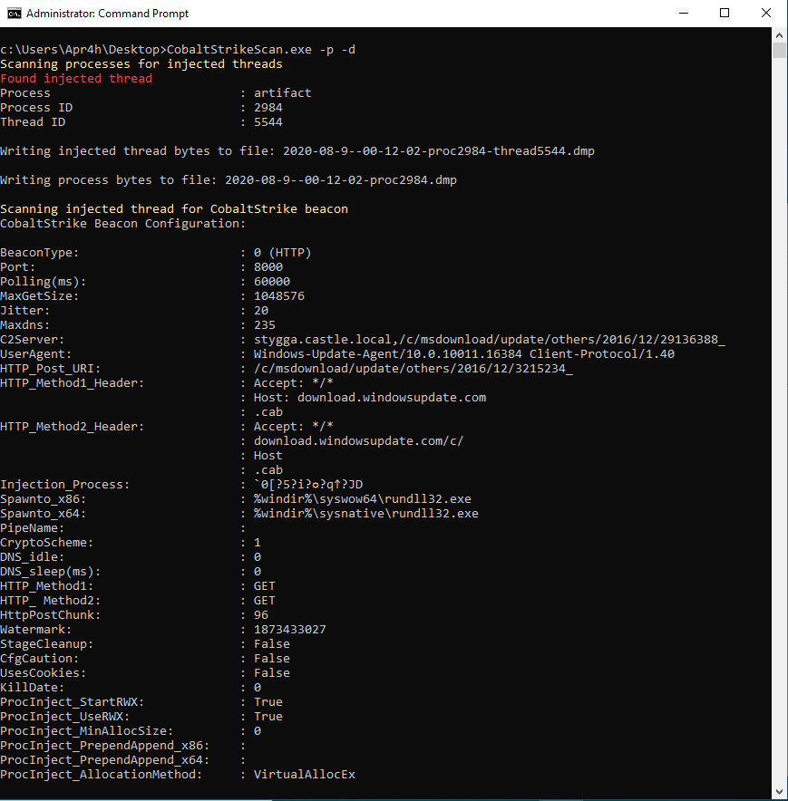

# CobaltStrikeScan
Scan files or process memory for Cobalt Strike beacons and parse their configuration.

CobaltStrikeScan scans Windows process memory for evidence of DLL injection (classic or reflective injection) and performs a YARA scan on the target process' memory for Cobalt Strike v3 and v4 beacon signatures. 

Alternatively, CobaltStrikeScan can perform the same YARA scan on a file supplied by absolute or relative path as a command-line argument.

If a Cobalt Strike beacon is detected in the file or process, the beacon's configuration will be parsed and displayed to the console.

## Cloning This Repo
CobaltStrikeScan contains [GetInjectedThreads](https://github.com/Apr4h/GetInjectedThreads) as a submodule. Ensure you use `git clone --recursive https://github.com/Apr4h/CobaltStrikeScan.git` when cloning CobaltStrikeScan so that the submodule's code is also downloaded/cloned.

## Building the Solution
Costura.Fody is configured to embed CobaltStrikeConfigParser.dll and GetInjectedThreads.dll in the compiled ConsoleUI.exe assembly. ConsoleUI.exe should then serve as a static, portable version of CobaltStrikeScan. For this to occur, ensure that the "Active Solution Platform" is set to x64 when building, and that the CobaltStrikeConfigParser and GetInjectedThreads projects are built before the ConsoleUI project is built, so that Costura.Fody can find the required DLLs to be embedded.

## Acknowledgements
This project is inspired by the following research / articles:
- [SpecterOps - Defenders Think in Graphs Too](https://posts.specterops.io/defenders-think-in-graphs-too-part-1-572524c71e91)
- [JPCert - Volatility Plugin for Detecting Cobalt Strike](https://blogs.jpcert.or.jp/en/2018/08/volatility-plugin-for-detecting-cobalt-strike-beacon.html)
- [SentinelLabs - The Anatomy of an APT Attack and CobaltStrike Beacon’s Encoded Configuration](https://labs.sentinelone.com/the-anatomy-of-an-apt-attack-and-cobaltstrike-beacons-encoded-configuration)

## Requirements
- 64-bit Windows OS
- .NET Framework 4.6
- Administrator or SeDebugPrivilege is required to scan process memory for injected threads

## Usage
```
  -d, --dump-processes      Dump process memory to file when injected threads are detected

  -f, --scan-file           Scan a file/process dump for CobaltStrike beacons

  -i, --injected-threads    Scan running (64-bit) processes for injected threads (won't scan for CobaltStrike beacons)

  -p, --scan-processes      Scan running processes for injected threads and CobaltStrike beacons

  -v, --verbose             Write verbose output (display detailed information for injected threads)

  -h, --help                Display Help Message

  --help                    Display this help screen.

  --version                 Display version information.
```

## Example

